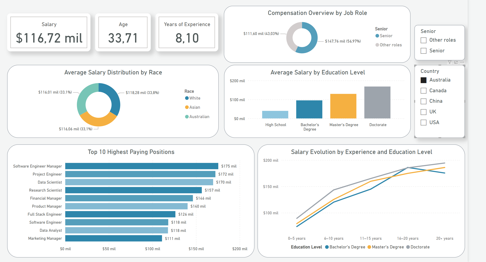

# 📊 Dashboard Interactivo de Análisis Salarial en Power BI

## 🚀 Descripción del Proyecto

Este proyecto consiste en un dashboard interactivo desarrollado en **Power BI** para el análisis detallado de **salarios por puesto y país**. Permite explorar cómo variables clave como la **experiencia**, el **nivel educativo** y el **rol profesional** impactan en la **remuneración económica**.

---

## 📁 Datos

La carpeta `data/` contiene la fuente de datos utilizada para este proyecto: el archivo `salary.csv`. Fue limpiado y transformado directamente en Power BI. Puedes cargar este archivo en Power BI Desktop para reproducir el análisis.

---

## ⚙️ Funcionalidades y Características

- ✅ **Limpieza y transformación de datos** con Power Query.
- 🔢 **Conversión y ajuste** de columnas numéricas y categóricas.
- 🧠 **Enriquecimiento del dataset** mediante nuevas columnas calculadas.
- 🧰 **Filtros y segmentaciones** interactivas.
- 💰 **Corrección y estandarización salarial**.
- 🌐 **Traducción y estandarización** de etiquetas para claridad internacional.
- 📐 **Métricas personalizadas en DAX** para un análisis más profundo.
- 🎨 **Diseño visual profesional** con paleta de colores coherente.

---

## ✅ Resultados y Beneficios

Este dashboard permite:

- 🔍 Identificar los **puestos mejor remunerados**.
- 🎓 Comparar **salarios según nivel educativo**.
- 🌍 Filtrar por **país** y **tipo de rol profesional**.

👥 Ideal para equipos de **Recursos Humanos**, **analistas de datos** y **managers** que buscan tomar decisiones informadas y basadas en datos.

---

## 🖼️ Vista Previa del Dashboard

